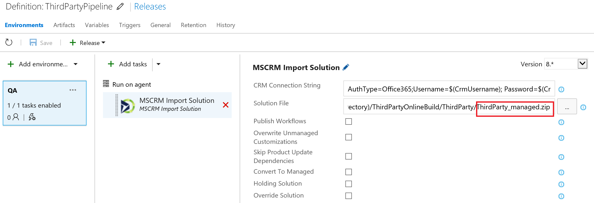
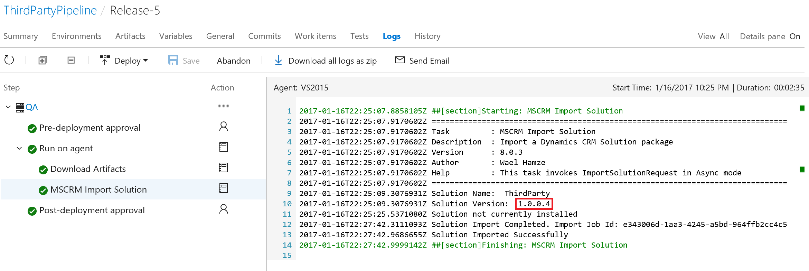

# Dynamics 365 Build Tools
**Dynamics 365 Build Tools is a set of tools that makes it easy and quick to automate builds and deployment of your Dynamics 365 CE solutions.**

This will allow you to setup a fully automated DevOps pipeline so you can deliver CRM more frequently in a consistent and reliable way.

## Compatibility

**Dynamics 365 (8.x.x)**
**Dynamics 365 (9.x.x)**
(Some tasks may work with previous version of CRM)

**VSTS/TFS** For support and installation [instructions](https://docs.microsoft.com/en-us/vsts/marketplace/get-tfs-extensions)

Works with Hosted VSTS Agents

## Task Catalog

Below is a list of tasks that are included with this extension.

**You must add the 'MSCRM Tool Installer' at the begining of every agent phase for the task to work.**

| Task | Description |
| --- | --- |
| **MSCRM Tool Installer** | Installs the Dynamics 365 tools required by all of the tasks |
| **MSCRM Ping** | Checks connectivity to a Dynamics 365 environment |
| **MSCRM Export Solution** | Exports a CRM Solution from the source CRM environment |
| **MSCRM Publish Customizations** | Publishes all CRM customizations |
| **MSCRM Set Version** | Updates the version of a CRM Solution |
| **MSCRM Extract Solution** | Extracts CRM Solution xml files from CRM Solution zip using SolutionPackager.exe |
| **MSCRM Pack Solution** | Packages a CRM Solution using SolutionPackager.exe |
| **MSCRM Import Solution** | Import a Dynamics CRM Solution package |
| **MSCRM Apply Solution** | Applies a solution upgrade after solution is import using stage for upgrade option |
| **MSCRM Copy Solution Components** | Add components from a given solution to another solution if not present |
| **MSCRM Remove Solution** | Deletes a Dynamics CRM managed/unmanaged Solution |
| **MSCRM Remove Solution Components** | Removes all components from a given CRM Solution |
| **MSCRM Package Deployer** | Deploys a CRM Package using the CRM Package Deployer PowerShell Cmdlets |
| **MSCRM Update Secure Configuration** | A task that updates Dynamics 365 plugin secure configuration |
| **MSCRM Update Plugin Assembly (deprecated)** | Updates Dynamics 365 plugin assembly during build |
| **MSCRM Update Configuration Records (preview)** | Upserts a configuration entity records using lookup/value pairs |
| **MSCRM Plugin Registration (preview)** | Updates Dynamics 365 plugin/workflow activity assembly/types/steps |
| **MSCRM Split Plugin Assembly (preview)** | Splits the plugin assembly into multiple plugin assemblies |
| **MSCRM Update Web Resources (preview)** | Updates Dynamics 365 Web Resources from source control |
| **MSCRM Get Online Instance By Name** | Gets an Online instance ID based on the name of the instance |
| **MSCRM Backup Online Instance** | Creates a backup of a Dynamics 365 Customer Engagement Online Instance |
| **MSCRM Set Online Instance Admin Mode** | Enable/Disable administration mode on Online Instances |
| **MSCRM Provision Online Instance** | Creates a new Dynamics 365 Customer Engagement Online Instance |
| **MSCRM Restore Online Instance** | Restores an online instance from a previous backup |
| **MSCRM Delete Online Instance** | Deletes an Online Instance |
| **MSCRM Set Online Instance Admin Mode** | Enable/Disable administration mode on Online Instances |

Some explanation for tasks that have the below in the names:

preview: New functionality. May contain some bugs. Subject to breaking changes while in preview.

deprecated: Task has been replaced with another task or is no longer required. Will be removed in future release.

## Build Automation

You can combine the xRM CI Framework tasks with other tasks to create a build definition as needed.

Below is a sample build definition that publishes customizations, updates solution version to match build number, exports the solution from CRM and then publishes the zip as an artifact in VSTS

## Release Automation

You can combine the xRM CI Framework tasks with other tasks to create a release definition as needed.

Below is a sample release definition that imports the solution generated from the latest build into the QA environment.

## More Information

For more documentation and source code, check out Github using the links on this page.

## Known Issues

MSCRM Restore Online Instance: May return 'internval server error' due to issue at vendor platform

## Version History

**8.0.x**
Initial Release

**8.1.x**  
Added task to backup CRM online instances

**8.2.x**  
MSCRM Backup Online Instance now uses instance name instead of instance id
Added Tasks for Provision, Restore, Delete and Get Online Instances  
Added Task for updating Secure Configuration of Plug-ins  

**8.3.x**  
Added Task Set Online Instance Admin Mode

**9.0.x**  
Updated to use Dynamics 365 CE v9 Assemblies and Tools

**9.1.x**  
Added Tasks to managing Plugin Registration  
Added Task for updating Web Resources  
Added Tasks for removing/copying solution components  
Added tasks for Exracting Customisations into source

**9.2.x**  
Added Tools Installer Task to improve efficieny and reduce extension size  
Added new task to upsert configuration records  
Improvements to Plugin Registration and Web Resource Tasks  
Updated to 9.0.2.4 SDK Assemblies and Tools

**9.3.x**  
Added Task to manage Service Endpoints  
Added Task to Delete a Solution  
Added Synch mode for Solution Import Task  
Added Async mode for Apply Solution Task  
Update Configuration Records Task to support updating mutiple value fields  

**9.4.x**  
Updated to 9.0.2.5 SDK Assemblies and Tools  

For more information on changes between versions, check the commits and releases on GitHub
